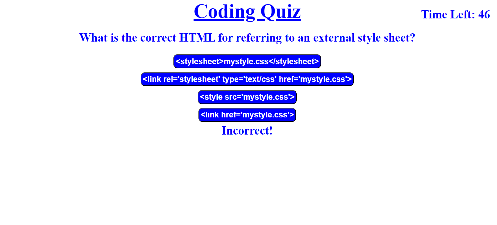

# timedquiz
## Description
### I created a timed coding quiz using JavaScript and interactive html. When you click the start button the test will start, the first question will appear, and a timer will start. If an answer is incorrect 10 seconds is subtracted from your time left. At the end of the quiz you can save your initials and score that will appear on the highscore list and be stored in local storage. There is a button to clear the highscores if you click on it. 
## Links
###
[Website]https://kdonnelly33.github.io/timedquiz/
[Repository]https://github.com/KDonnelly33/timedquiz
## Screenshots
 
 
 